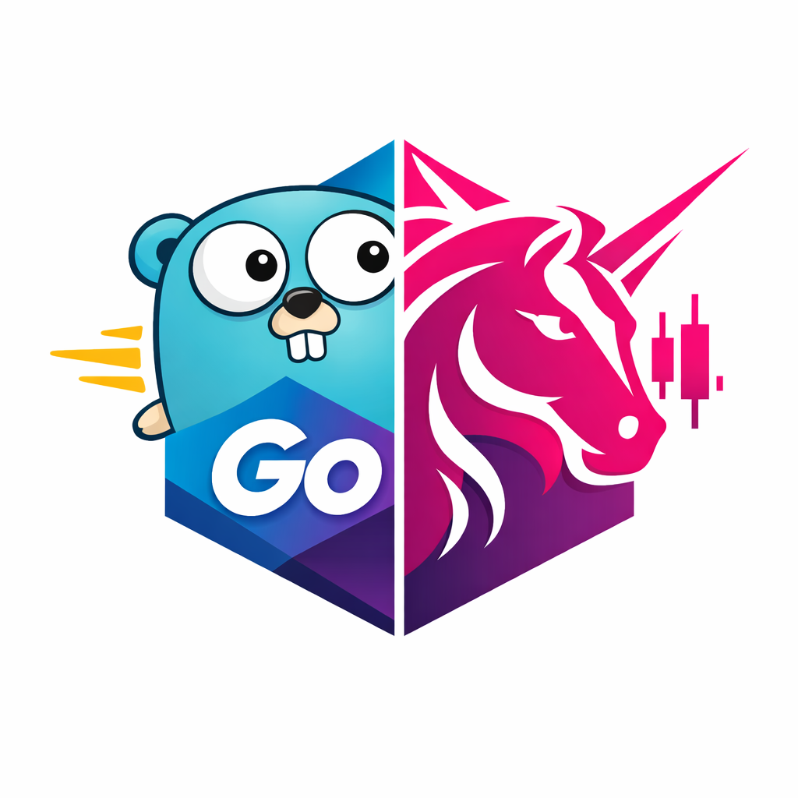

# go-uniswap 

🦄 🦄 🦄 🦄 Centralized implementation of Uniswap smart contracts

## Changelog

Detailed changes for each release are documented in the [release notes](https://github.com/openchat-im/go-uniswap/releases).

## License

[MIT](https://opensource.org/licenses/MIT)

Copyright (c) 2013-present, Yuxi (Evan) You
